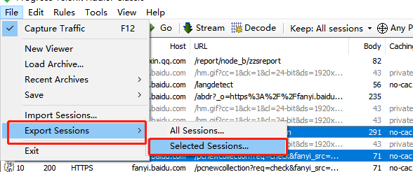
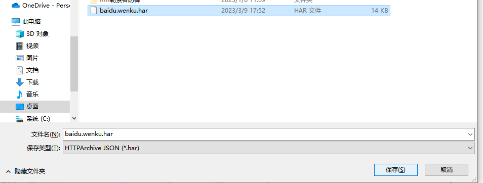
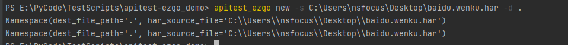
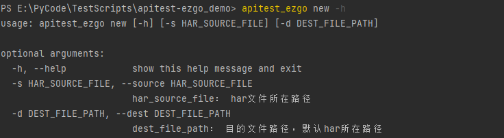

特点

**自动组装请求参数**：从抓包文件中自动提取组装请求参数，无需手动填充
**灵活请求参数替换**：兼容jsonpath，按需自动替换请求参数中的任意字段
**自动处理请求头**：自动处理诸如content-type等需要分神解决的http请求头，可专注于开发自动化用例
**灵活的数据提取**：兼容jsonpath，按需使用jpath表达式从响应中提取数据
**多种数据库连接池**：数据库访问使用连接池管理，并支持常见主流数据库的访问与操作
**复杂数据一键对比**，表格显示不一致结果：支持各种嵌套json格式数据对比，并通过表格显示不一致结果，便于定位
**PIP安装，管理方便**：已发布到PYPI源，便于管理，兼容测试平台


快速入门

1、安装

`pip install apitest_ezgo`

2、Har包抓取

Har文件是http archive文件，几乎所有http抓包工具都支持将请求保存为har文件，下图以fiddler为例


3、将Har包解析为json文件

 命令行执行  apitest_ezgo new 命令即可自动将har包解析为请求所需要的json文件，并将json文件放入自动化目录



可使用 apitest_ezgo new -h 命令查看 apitest_ezgo new 使用说明


json文件已符合http请求格式，并提取所有必要信息，可直接用于发起请求，baidu.wenku.json内容如下

`{
    "/message/getnotice": {
        "path": "/message/getnotice",
        "host": "https://wenku.baidu.com",
        "params": {
            "url": "/search"
        },
        "method": "GET",
        "headers": {
            "Sec-Fetch-Site": "same-origin",
            "Sec-Fetch-Mode": "cors",
            "User-Agent": "Mozilla/5.0 (Windows NT 10.0; Win64; x64) AppleWebKit/537.36 (KHTML, like Gecko) Chrome/110.0.0.0 Safari/537.36",
            "sec-ch-ua-platform": "\"Windows\"",
            "sec-ch-ua-mobile": "?0",
            "Content-Type": "application/json;charset=utf-8",
            "sec-ch-ua": "\"Chromium\";v=\"110\", \"Not A(Brand\";v=\"24\", \"Google Chrome\";v=\"110\"",
            "Sec-Fetch-Dest": "empty"
        }
    },
    "/api/get": {
        "path": "/api/get",
        "host": "https://wkdsp.baidu.com",
        "json": {
            "slotinfo": [
                {
                    "mustshow": 1,
                    "num": 1,
                    "slotid": 47,
                    "keyword": "Python"
                },
                {
                    "mustshow": 1,
                    "num": 1,
                    "slotid": 17,
                    "keyword": "Python"
                }
            ],
            "exinfo": "",
            "flowType": "pc",
            "pid": 1
        },
        "method": "POST",
        "headers": {
            "Sec-Fetch-Site": "same-site",
            "Sec-Fetch-Mode": "cors",
            "User-Agent": "Mozilla/5.0 (Windows NT 10.0; Win64; x64) AppleWebKit/537.36 (KHTML, like Gecko) Chrome/110.0.0.0 Safari/537.36",
            "sec-ch-ua-platform": "\"Windows\"",
            "sec-ch-ua-mobile": "?0",
            "Content-Type": "application/json;charset=UTF-8",
            "sec-ch-ua": "\"Chromium\";v=\"110\", \"Not A(Brand\";v=\"24\", \"Google Chrome\";v=\"110\"",
            "Sec-Fetch-Dest": "empty"
        }
    }
}`

4、发起请求

    `from apitest_ezgo.FastRequest import FastRequest
    # 实例化对象，为方便使用可设置json文件根目录
    request_client = FastRequest(template_path=r"E:\PyCode\TestScripts\apitest-ezgo_demo\Template\baidu.wenku.json")
    # 发起请求，传入json文件名和请求名称
    res = request_client.fast_request(request_name="/api/get", resp_jpath="$.data")
    print (res)`

FastRequest: 各类请求方式各类content-type的快速请求组件，功能与参数说明如下，更多示例见request请求组件FastRequest

    `class FastRequest(object):
        def __init__(self, template_path="", base_url="", session=None):
            """
            Http对象
            @param template_path: json请求模板文件目录
            @param base_url：服务基础路径，例如： https:www.baidu.com/
            @param session: http session
            """           
         
        def fast_request(self, request_name, file_path='', resp_jpath=None, session=None, index=0, **replace_dict):
            """
            支持各类请求方式各类content-type的请求入口
            @param file_path: json文件路径，可为相对于template_path的相对路径，不传时template_path需要到文件
            @param request_name: json文件中请求的名称，即字典名称
            @param resp_jpath: 需要提取响应数据的jsonpath
            @param session: 支持临时session请求，不传默认使用实例session
            @param index: 返回数据的索引，默认为0， 只能传入数字、random 或None； random表示从列表中随机抽取一个，None表示返回完整列表
            @param replace_dict:需要更新请求参数，传入对应jpath 和 值，如果需要将某个参数从请求中删除，将值更新为{REMOVE}
                                例如{"$.headers.User-Agent": "new agent", "$..sec-ch-ua": '{REMOVE}'}
            @return: 传入resp_jpath取对应数据，默认返回响应对象
            """`


5、数据库获取期望数据
以psql为例

    ```# 导入依赖包
    import psycopg2
    import psycopg2.extras
    from apitest_ezgo.DbHelper import SqLHelper``
     
    # 数据库配置
    psql_conf = {
        "host": 'xx.xx.xx.xx',
        "port": '5432',
        "user": 'postgres',
        "password": 'xxxxx',
        "database": 'scanner',
        "cursor_factory": psycopg2.extras.RealDictCursor # 设置返回数据格式为字典
    }
     
    # 注意：creator: 目标库Python库对象，如psql传入psycopg2对象
    psql = SqLHelper(creator=psycopg2, **psql_conf)
     
    # 查询
    sql1 = 'SELECT x.* FROM public.rule_item x WHERE x.rule_type IN (5) AND x.match_type IN (0)'
    ret = psql.select_all(sql=sql1)
    print(ret)`
6、结果比对
假设如下数据，从接口取到的响应数据如json1，数据库查询的期望数据为json2

    json1 = {
        "url": u"https://miao.baidu.com/abdr",
        "method": "POST",
        "data": {
            "a": 3.1415,
            "b": {
                "c": "2"
            },
            "d": 1234,
            "e": []
        }
    }
     
    json2 = {
        "url": "https://miao.baidu.com/abdr",
        "method": "POST",
        "data": {
            "a": 3.141592,
            "b": {
                "c": [
                    2,
                    3
                ]
            },
            "d": "1234"
        },
        "test1": """{"aa":11, "bb":22}"""
    }

使用compare_json进行对比

    `# 引入compare_json
    from FastHttp.Compare import compare_json
    compare_json(json1, json2)`


对比结果如下：compare_json参数说明，更多示例见结果比对组件Compare

    def compare_json(json1, json2, exclude_paths=None, significant_digits=4, format_value=True, **kwargs):
        """
            对比组件
        :param json1: 实际结果
        :param json2: 期望结果
        :param exclude_paths: 不进行比对，需要排除的字段jsonpath，多个自动使用列表或者 英文逗号分割的字符串。例如： $.data.result /  ["$.data.result", "$.data.msg"]
        :param significant_digits: 数值对比保留小数位数，默认为4
        :param format_value: 是否需要格式化处理字典value，如自动将Unicode字符str化，数值统一保留小数，保留小数依赖significant_digits参数
        :param kwargs: 其他参数
        """

F&Q:

1、已支持Python2.7 与Python3.X

2、 F:  报错 “'collections' has no attribute 'Callable'”，“module 'collections' has no attribute 'Mapping'`”

   Q: Python3.10 对collections 进行了改造，在本地collections.__init__文件中加入代码： from collections.abc import * 即可

3、已支持multipart/form-data格式文件上传与下载